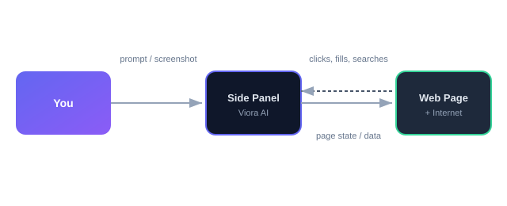
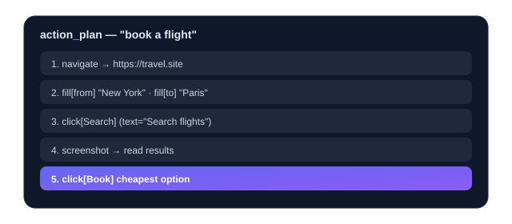
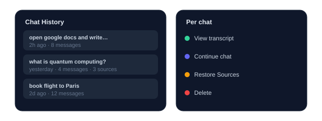

# How Viora Works 🤖

Viora is a browser-automation AI that lives in your side panel. It can **see the page you're on, click things, fill forms, navigate, and search the web** — then explain what it did. This guide shows how it thinks, what it can do, and how to get the best results.

## 1. Two modes of thinking

Every message you send is routed into one of two modes:

| Mode | When | What Viora does |
|------|------|-----------------|
| **Chat** | General questions, screenshots, "what is…" | Replies in plain text (and may search the web) |
| **Action** | "do X on this website", automations, multi-step tasks | Produces a step-by-step **action plan** and runs it |

> 💡 Tip: In **Plan mode** (toggle in the side panel) Viora only *proposes* a plan and never touches your page — great for reviewing before it acts.

## 2. The action plan

When you ask Viora to do something on a website, it replies with a JSON plan made of **steps**. Each step is one of:

- `navigate` — open a URL
- `click` — click a button / link / element
- `fill` — type text into a field
- `scroll` — scroll the page
- `extract` / `extract_links` — read data or links from the page
- `screenshot` — capture the page so the AI can "see" it
- `wait_for` — pause until an element appears
- `web_search` — search the internet and collect **Sources**

## 3. Web search & Sources 🌐

Ask a factual question like *"what is quantum computing?"* and Viora will run a `web_search` step. It opens a search results page, collects the top links, and shows them as a **🌐 Sources** block under its answer.

The collected sources are saved with the conversation, so they appear again when you revisit the chat from history.

## 4. Learning on every chat 🧠

With **Learn on every chat** enabled (Settings → AI Behavior), every conversation is saved to your **Chat History**. Open the history drawer in the side panel to:

- **View** the full transcript of any past chat
- **Continue** a previous conversation (it reloads the messages + sources)
- **Delete** chats you no longer need

## 5. Tuning the AI (Settings → AI Behavior)

These controls change how Viora thinks and replies — they are sent to the model with every request:

- **Response detail** — Concise · Balanced · Detailed
- **Tone** — Friendly · Professional · Casual · Clinical
- **Response language** — force a language or auto-match you
- **Proactive web search** — search automatically for real-world facts
- **Learn on every chat** — persist & recall conversations
- **Auto-retry failed steps** — recover from automation hiccups
- **Max steps per task** — safety cap to prevent runaway loops

## 6. Best practices ✅

1. **Be specific about the goal.** "Buy the cheapest red t-shirt under $20 and add to cart" beats "do some shopping."
2. **Let it screenshot.** When a click target is ambiguous, Viora captures the page and reads it — don't fight the process.
3. **Use Plan mode first** for risky or expensive actions.
4. **Correct it.** If Viora clicks the wrong thing, tell it — the next attempt adapts.
5. **Check Sources** for factual answers so you can verify.

## 7. Privacy & safety 🔒

- Your API key is stored **locally** in the browser, never uploaded except to the AI provider you choose.
- Viora only acts on the **current tab** you point it at.
- **Domain Permissions** let you block or allow specific sites.
- **Auto-confirm sensitive** (off by default) controls whether Viora may type into password / payment fields without asking.

---

*Viora — your AI copilot for the web.*
